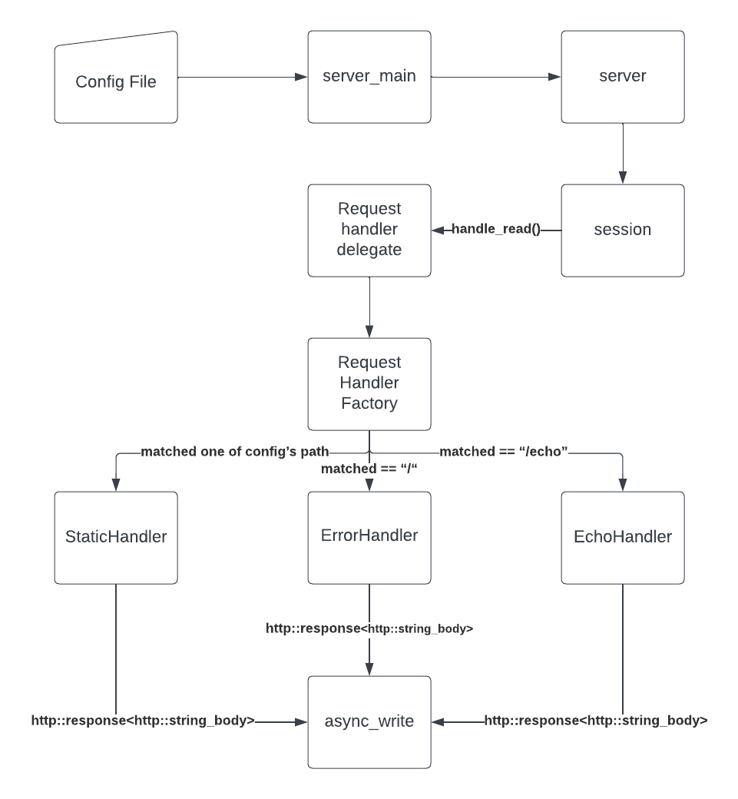

# CS 130 Swan Server README

## Table of Contents

* [Source Code](#source-code)
* [Build](#build)
* [Testing](#testing)
* [Running the Server](#running-the-server)
* [Adding a Request Handler](#adding-a-request-handler)

## Source Code

### Diagram 

The server creates the map of location prefixes to handler factories, hands it off to session, and then session hands it off to request_handler_delegate. In request_handler_delegate, depending on the longest prefix matched (default to "/"), the respective factory will instantiate the appropriate handler.

### <u>Config file format</u>

Config files specify the port the server will be listening on as well as the mapping from client side uri to server local files. The format can be generalized to:

~~~~
server {
  listen  ${PORT_NUMBER};

  location ${clientside_directory_1} StaticHandler {
    root ${server_local_directory_1};
  }

  location ${clientside_directory_2} StaticHandler {
    root ${server_local_directory_2};
  }
}
~~~~

Note that currently in our groups implementation, the location block must be nested within a server block. The listen block currently does not have to be in a server block, and can be overwritten if there are multiple listen statements in the config file. The factory within `server::create_factory_maps()` will new a StaticHandlerFactory for each of the locations specified. 

## Build

To run the server, enter the build subdirectory and run make:
~~~~
> cd build
> make
~~~~
  

## Testing

After building the server, you can run the full test suite in the `build` directory using:
~~~~
> cd build
> make test
~~~~
To run just the integration tests, use the following command:
~~~~
> cd tests
> ./integration_test.sh
~~~~

### <u>Adding Unit Tests</u>

Depending on what part of the server you are testing, you can choose between:
1. request_handler_delegate_test.cc
2. session_test.cc
3. request_handler_test.cc
4. config_parser_test.cc

To add a test within one of these files, follow the format in each respective file.

If you are creating a new test file, you will need to add an executable within `CMakeLists.txt` and update the `gtest_discover_tests` suite as well as adding your new file to `generate_coverage_report`. Please use the variables in `set()` to reduce clutter and improve readability.

### <u>Adding Integration Tests</u>

Firstly, edit `integration_tests.sh` within ./tests/.
~~~~
> cd tests/
> emacs integration_tests.sh
~~~~
Create a function with the format:
~~~~
function ${function_name_test}() 
{
    start_local_server
	//replace this line with a request to the server 
    //example:
    //'GET /echo HTTP/1.1\r\n\r\n'
	sleep 0.5 //this is crucial, or else the server may not respond in time for test
	kill ${local_server_pid} #nc process is killed when the server is killed
	diff ${INTEGRATION_TEST_PATH}/${expected_file_output} /tmp/actual
}
~~~~
Lastly, add your new test to the `test_list` array using the format
${function_name_test} without the _test.

## Running the Server

After building the server, you can run the server from the base directory using:
~~~~
> ./build/bin/server <config file>
~~~~

This repository currently includes a default config file called `server_config` in the base directory.
  

## Adding a Request Handler

To add a new Request Handler, you will need to:
1. [Create a new Request Handler](#create-a-new-request-handler)
2. [Create a new Request Handler Factory](#create-a-new-request-handler-factory)
3. [Update Factory Map Generation in server.cc](#update-factory-map-generation-in-servercc)
4. [(Optionally) Update Config File and Parsing](#optionally-update-config-file-and-parsing)

*Make sure to [add unit tests and integrations tests](#adding-unit-tests) for new code as appropriate.*

### <u>Create a new Request Handler</u>

To create a new Request Handler class, create a new header (.h) and source file (.cc) in `/include` and `/src` respectively. Make sure the files names are snake case (e.g., new_handler.cc).

All new Request Handlers must:
1. Be derived from the `RequestHandler` abstract class
2. Maintain the naming convention of `[RequestType]Handler`
3. Implement the public `handle_request(...)` method with the following interface:
    ~~~~
    bool handle_request(http::request<http::string_body> httpRequest, http::response<http::string_body>& httpResponse)
    ~~~~
4. (Optionally) have a non-default constructor. Any information that the Request Handler needs from the server (e.g., config file information) should be passed via the constructor by the Request Handler Factory (describe below) and stored in private member variables.

For some examples, take a look at `include/static_handler.h`, `src/static_handler.cc`, `include/echo_handler.h`, and `src/echo_handler.cc`.

### <u>Create a new Request Handler Factory</u>

To create a new Request Handler Factory class, create a new header (.h) and source file (.cc) in `/include` and `/src` respectively. Make sure the files names are snake case (e.g., new_handler_factory.cc).

All new Request Handler Factories must:
1. Be derived from the `RequestHandlerFactory` abstract class
2. Maintain the naming convention of `[RequestType]HandlerFactory`
3. Implement the public `create()` method which `new`s and returns a RequestHandler object with the following interface:
    ~~~~
    RequestHandler* create();
    ~~~~
4. (Optionally) have a non-default constructor. Any information that the server needs to pass to the Request Handler Factory (e.g., config file information) to generated Request Handlers should be passed via the constructor and stored in the Factory's private member variables.

For some examples, take a look at `include/static_handler_factory.h`, `src/static_handler_factory.cc`, `include/echo_handler_factory.h`, and `src/echo_handler_factory.cc`.

### <u>Update Routes Generation in server.cc</u>

Factory maps the prefix of the request uri to the corresponding request handler factory. Each type of factory is created only once in the server. Since all factory classes are new-ed using a `shared_ptr`, the pointer will be deleted at destruction (aka when the server is terminated). `create_factory_maps()` will route a new static factory for each mapping in config_'s filesystem_map_, which is created in config_parser. 

To add the new request handling functionality to the server, the Request Handler Factory needs to be added to the server's factory map (i.e., `routes`). This can be done by adding to the existing `create_factory_map()` method in `src/server.cc`. As mentioned previously, the `routes` map maps request uri prefixes to Request Handler Factory pointers. 

If the new Request Handler doesn't require any config file information, the Request Handler Factory can simply be added as follows:
~~~~
RequestHandlerFactory* [request_type]HandlerFactory = new [request_type]HandlerFactory();

routes.insert({[request uri prefix], [request_type]HandlerFactory});
~~~~

If the new Request Handler does require config file information, additionally parsing and insertions will be necessary.

See the existing implementation for adding `EchoHandlerFactory` (handler without config requirements) and `StaticHandlerFactory` (handler with config requirements) in `create_factory_map()` for further details.

### <u>(Optionally) Update Config File and Parsing</u>

If any new information needs to be added to and parsed from the config file for the new Request Handler, make sure to update the `server_config` file in the base directory and add the parsing method and logic to `include/config_parser.h` and `src/config_parser.cc`. 

All information parsed from the config file is stored in the private `statements_` data member in the `NginxConfig` class. To extract specific information from the config file, implement a new method to parse `statements_`, store the information into a private member variable, and create a public getter method to access the data. 

Here is an example of how we currently extract the location -> root mapping for the `StaticHandler` requests:

The public method `extract_filesystem_map()` extracts and stores the mapping in a private `filesystem_map_` and accessed using the public `get_filesystem_map()` method.
~~~~
// in config_parser.h

class NginxConfig {
 public:
  ...
  std::map<std::string, std::string> get_filesystem_map();
  void extract_filesystem_map();
  ...
 private:
  std::map<std::string, std::string> filesystem_map_;
};
~~~~
To see the implmentation of `extract_filesystem_map()`, take a look at `src/config_parser.h`.